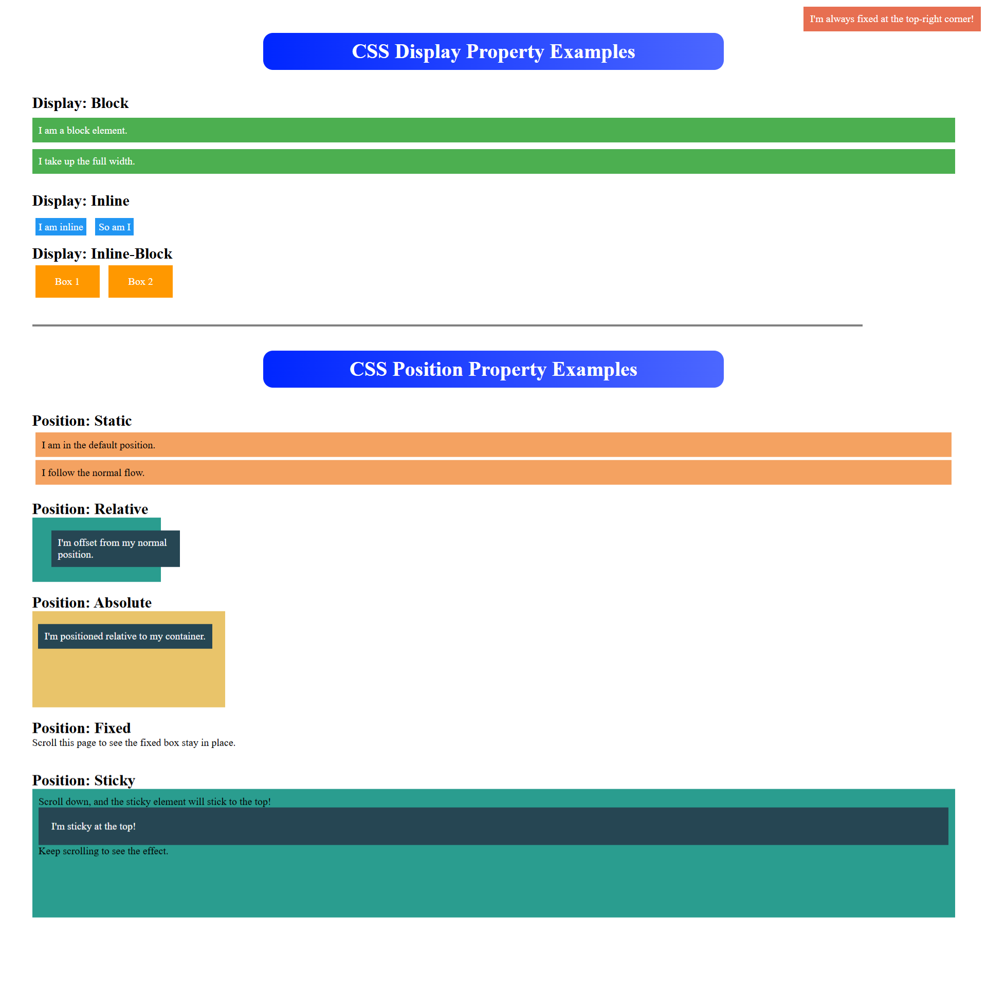

# CSS Display and Position property Examples

## Project Overview

This project demonstrates the usage of the CSS `display` and `position` properties through practical examples. It highlights how these properties work and affect the layout and positioning of elements on a webpage. The project is structured to provide clear, visually appealing examples for better understanding.

---

## Features

### CSS Display Examples

1. **Block Display**:

   - Elements are displayed as blocks, taking up the full width available.
   - Example text spans are styled as block elements.

2. **Inline Display**:

   - Elements are displayed inline without breaking into a new line.
   - Demonstrates how inline elements stack horizontally.

3. **Inline-Block Display**:
   - Combines the characteristics of inline and block elements.
   - Boxes are displayed inline while allowing block-like styling such as padding and margins.

### CSS Position Examples

1. **Static Position**:

   - Default positioning where elements follow the normal document flow.

2. **Relative Position**:

   - Elements are positioned relative to their normal flow location.

3. **Absolute Position**:

   - Elements are positioned relative to their nearest positioned ancestor.

4. **Fixed Position**:

   - Elements are fixed relative to the viewport and remain in place even while scrolling.

5. **Sticky Position**:
   - Combines relative and fixed positioning. Elements stick to a specified position while scrolling, then return to normal flow when no longer needed.

---

## Technologies Used

- **HTML5**: Structuring the content of the webpage.
- **CSS3**: Styling the webpage and demonstrating various `display` and `position` properties.

---

## Author

**Asif Iqbal**  
Beginner Full Stack Web Developer  
Passionate about exploring and sharing web development concepts.
